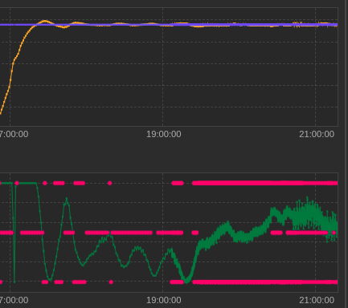
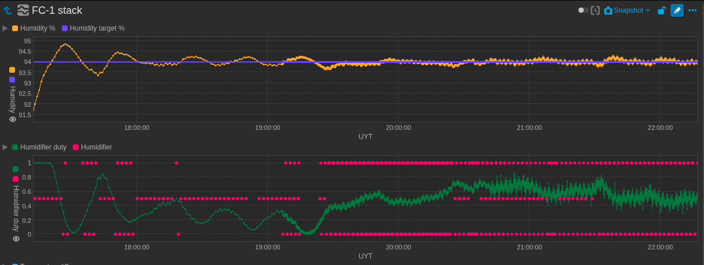
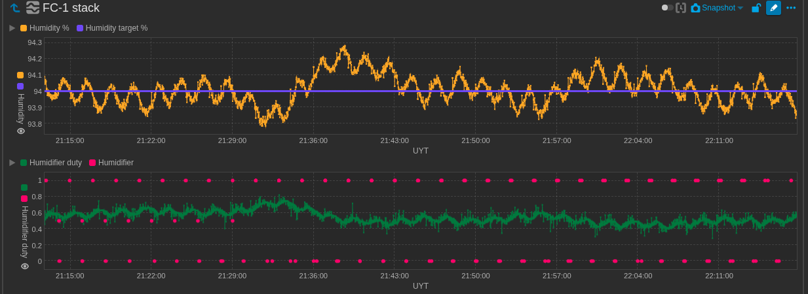

# PID Calibration Notes — FC-1 Humidity

**Date:** 2026-05-03  
**Chamber:** FC-1 stack  
**Target:** 94% RH

## TODO

- [ ] Find current P/I/D values in config
- [ ] Reduce P by ~30% to reduce oscillation amplitude
- [ ] Consider adding a ±0.3% deadband to stop controller chasing sensor noise

## First Run Observations

Humidity settles well to setpoint but oscillates with ~5-7 minute period, ±0.2-0.3% amplitude. Classic lag-induced oscillation — duty adjustments take a few minutes to affect sensor reading, causing late corrections.

- Initial heat-up (17:00–19:00): underdamped, large overshoot/undershoot — P or I likely too high
- Steady state (20:00+): centered on 94%, oscillating regularly, duty steady at ~0.55–0.65
- Actuator: PWM duty on humidifier, cycling every couple of minutes at setpoint

## Charts

